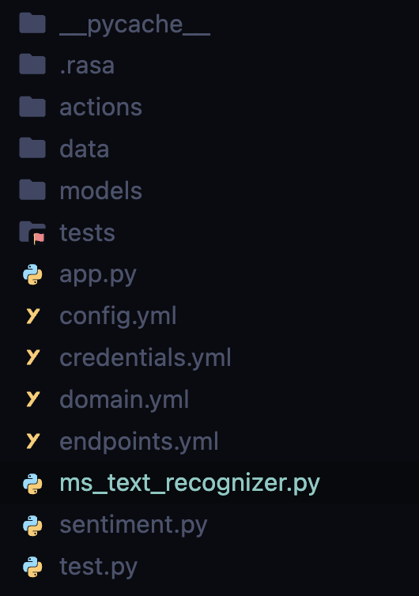
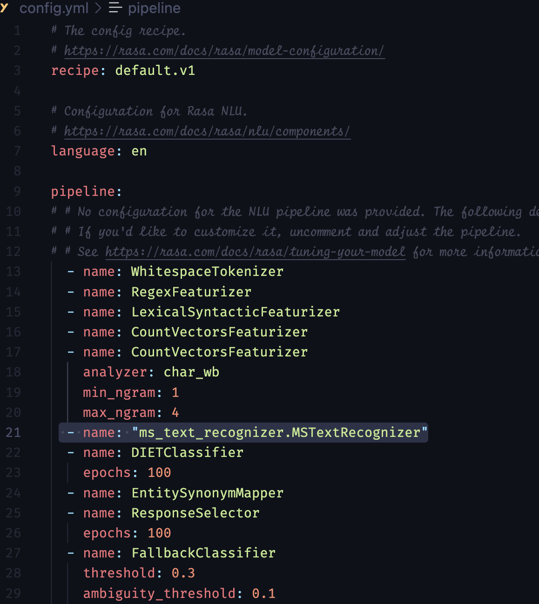
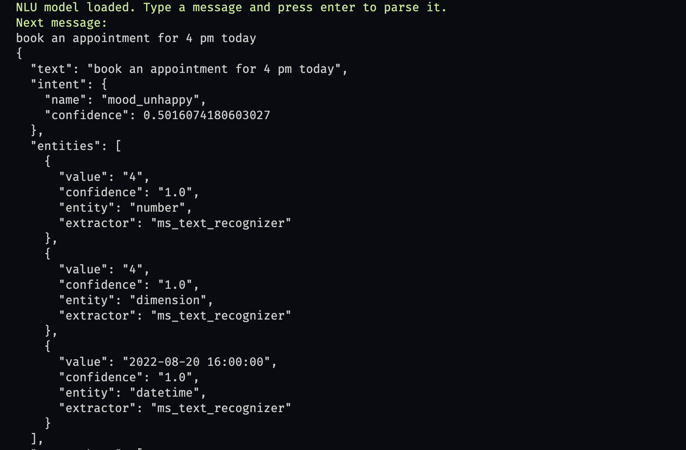

# Custom Entity Extractor
Entity extractor based on [Microsoft Text Recognzier](https://github.com/microsoft/Recognizers-Text) as an alternative to Duckling Extractor 

You can find the list of entity types that the extractor supports [here](https://github.com/microsoft/Recognizers-Text#supported-entities-across-cultures)

_note: Make sure you have installed the Rasa version >3.x_

## Steps

- Install the [Microsoft Text Recognzier](https://github.com/microsoft/Recognizers-Text/tree/master/Python) python library

> pip install recognizers-text-suite

- add `ms_text_recognizer.py` in your project directory as show below

- next add the extractor name in your `config.yml` file as show below

- now you can train your Rasa model so that it predicts the entity

- after you have trained the model, you  can test the model for entity extraction and you can see the below results

